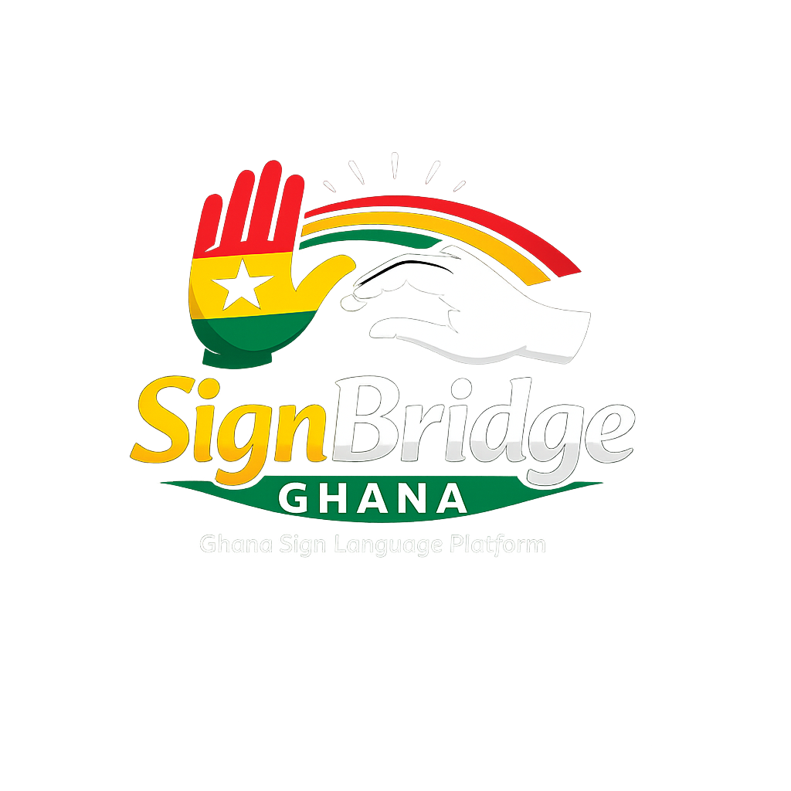

<div align="center">

  

  # 🇬🇭 SignBridgeGhana
  ### **Ghanaian Sign Language (GSL) Digital Dictionary & Real-Time Translation Platform**

  [](package.json)
  [](https://github.com/charwayyyyyy/thesignbridgeghana)
  [](public/data/dictionary/index.json)
  [](public/manifest.webmanifest)
  [](LICENSE)
  [](https://vitejs.dev/)

  <p align="center">
    <strong>The official digital gateway and real-time translation engine for Ghanaian Sign Language.</strong><br/>
    Digitized with precision from the authoritative 318-page <em>Ghanaian Sign Language Dictionary (3rd Edition)</em> published by the <strong>Ghana National Association of the Deaf (GNAD)</strong> and the <strong>Special Education Division of the Ghana Education Service (GES)</strong>.
  </p>

  <p align="center">
    <a href="#-central-documentation-hub">Docs Hub</a> •
    <a href="docs/COLLAB.md">Collaborator Guide</a> •
    <a href="docs/PROJECT_PHASE.md">Phase Tracker</a> •
    <a href="#-key-platform-features">Features</a> •
    <a href="#-translation-studio-architecture">Translator Studio</a> •
    <a href="#-quickstart--local-development">Quickstart</a>
  </p>

</div>

---

## 📚 Central Documentation Hub

All detailed documentation, architectural blueprints, design tokens, and project phase tracking are organized in the [`/docs`](docs/) directory:

| Document | Purpose & Summary |
| :--- | :--- |
| 🤝 **[`docs/COLLAB.md`](docs/COLLAB.md)** | **Collaborator & System Architecture Guide** — Detailed inventory of all 10 pages, component registries, service APIs, CV/3D systems, design token specs, and onboarding protocols. |
| 🗺️ **[`docs/PROJECT_PHASE.md`](docs/PROJECT_PHASE.md)** | **Project Phase & Progression Tracker** — Chronological ledger tracking changes across all 6 phases, live status matrix, and milestone progress. |
| 💎 **[`docs/DESIGN.md`](docs/DESIGN.md)** | **Design System Specifications** — High-contrast monochrome palettes, Liquid Chrome specular borders, frosted glass slabs, and typography tokens. |
| 📖 **[`docs/README.md`](docs/README.md)** | **Complete Platform Manual** — In-depth overview of the entire dataset, offline PWA caching, dictionary partitioning, and validation reports. |

---

## 🌟 Project Overview & Vision

**SignBridgeGhana** is a high-performance web-native platform and cross-platform PWA engineered to preserve, teach, and elevate **Ghanaian Sign Language (GSL)**. Over 110,000 Deaf and hard-of-hearing Ghanaians use GSL daily as their primary language.

SignBridgeGhana bridges deaf and hearing communities through:
1. **Authoritative Preservation**: Digital preservation of all 1,514 official GSL signs with 300 DPI illustration crops and movement breakdowns.
2. **Two-Way Real-Time Translation**:
   - **Sign ➔ Text & Audio (Deaf to Hearing)**: Watches gestures via camera, classifies them against the GSL index with MediaPipe Holistic, outputs live text, and reads aloud via Web Speech Synthesis (TTS).
   - **Text/Voice ➔ Sign (Hearing to Deaf)**: Types or dictates English speech, animates a 2D Canvas skeletal avatar with complete 5-finger articulation, facial expressions, and directional arrows, synchronizing official dictionary cards.
3. **Zero-Latency Offline Access**: Full PWA precaching ensuring the dictionary works seamlessly without internet across schools and clinics in Ghana.

```
       ┌──────────────────────────────────────────────────────────────┐
       │     Ghanaian Sign Language Dictionary (3rd Edition PDF)      │
       │                   [ 241.2 MB / 318 Pages ]                   │
       └──────────────────────────────┬───────────────────────────────┘
                                      │
                         [ Extraction & Validation ]
                                      │
                                      ▼
       ┌──────────────────────────────────────────────────────────────┐
       │            Git-Friendly Partitioned JSON & WebP              │
       │   • 1,514 Signs   • 24 Categories   • 9 Deaf Schools Plates  │
       └──────────────────────────────┬───────────────────────────────┘
                                      │
                                      ▼
       ┌──────────────────────────────────────────────────────────────┐
       │             SignBridgeGhana v2.0 Platform                    │
       │  ┌──────────────────────┐      ┌──────────────────────────┐  │
       │  │ Sign → Text AI       │      │ Text → 3D Avatar Signer  │  │
       │  │ MediaPipe Holistic   │ ◄──► │ Three.js Procedural Rig  │  │
       │  │ Audio TTS Narration  │      │ Speech Recognition Input │  │
       │  └──────────────────────┘      └──────────────────────────┘  │
       │  ┌────────────────────────────────────────────────────────┐  │
       │  │ MiniSearch Engine • Liquid Chrome UI • Offline PWA     │  │
       │  └────────────────────────────────────────────────────────┘  │
       └──────────────────────────────────────────────────────────────┘
```

---

## ✨ Key Platform Features

| Feature | Description |
| :--- | :--- |
| 🔍 **Zero-Latency Global Search** | In-memory MiniSearch index supporting exact matches, prefix completion, fuzzy typo tolerance (`sch` ➔ `School`), and live dropdown previews. |
| 🔤 **A–Z Alphabetical Navigation** | Interactive ribbon with live sign counts for every letter of the alphabet (e.g. `A · 90`, `B · 106`, `S · 163`). |
| 📚 **24 Thematic GSL Categories** | Complete organization into official chapters including *Family & People*, *Food*, *Education & Communication*, *Towns & Regions*, *Technology*, *Health*, and *Idiomatic Expressions*. |
| 🖼️ **High-Resolution Sign Plates** | Crystal-clear 200–300 DPI sign illustration crops, phonetic breakdowns, step-by-step signing movements, and book page attributions. |
| ✋ **Manual Alphabet & Numerals** | High-fidelity interactive plates for GSL Fingerspelling (A–Z) and GSL Base Numerals (1–1,000). |
| 🏫 **Deaf Schools of Ghana Directory** | Interactive historical guide to Ghana's 9 specialized deaf institutions founded since 1957 (Mampong-Akuapem, Bechem, Cape Coast, SEC-TECH, etc.). |
| 🤖 **GSL Translation Studio** | Multi-mode studio: Camera Sign-to-Text, 3D Avatar Text-to-Sign, and Sign Sequence Composer. |
| ⭐ **Offline Favorites & Study Notes** | LocalStorage-persisted bookmarks with custom study notes and JSON export/import. |
| 📱 **PWA & Mobile Installable** | Add to Home Screen on mobile and desktop, full offline capability with service worker precaching. |
| ♿ **Accessible & High-Contrast** | WCAG high-contrast compliance, screen-reader semantic HTML, keyboard shortcuts (`/` to search, `Esc` to close), and mobile-first glassmorphism. |

---

## 🤖 Translation Studio Architecture

The Translation Studio (`/translate`) consists of three production subsystems:

1. **Sign → Text & Audio (Camera AI)**:
   - Uses `@mediapipe/holistic` to track 21 hand landmarks, 33 body pose landmarks, and 468 face mesh points.
   - Computes normalized hand shape vectors and matches against GSL sign signatures with confidence thresholds.
   - Temporal confirmation buffer prevents false positives and jitter.
   - Speaks detected words aloud using **Web Speech API SpeechSynthesis**.
2. **Text/Voice → Sign (2D Skeletal Avatar Engine)**:
   - High-fidelity 2D Canvas skeletal avatar with forward-kinematics arm articulation and face-level sign reach (e.g., forehead, chin, mouth).
   - Detailed 5-finger articulation with 3 segments per finger (MCP, PIP, DIP) and directional movement arrows directly matching GSL dictionary notations.
   - Realistic facial expressions (eyebrows, eyes with catchlights, mouth shapes) synchronized with sign categories.
   - Accepts typed English or speech via **Web Speech Recognition** and synchronizes with official GSL dictionary cards.
3. **Interactive Sign Composer**:
   - Allows educators and learners to arrange custom GSL sign sequences with timing and dwell controls.

---

## 📁 Repository Architecture

The repository maintains a clean, clutter-free root layout with all documentation centralized in `/docs` and assets organized in `/public`:

```text
thesignbridge/
├── docs/                      # Central Documentation Hub
│   ├── COLLAB.md              # Collaborator onboarding & systems breakdown
│   ├── PROJECT_PHASE.md       # Project phase tracker & progression ledger
│   ├── DESIGN.md              # Design system specifications & tokens
│   └── README.md              # In-depth platform manual
│
├── public/                    # Static assets & partitioned GSL dataset
│   ├── icons/                 # Brand favicons & PWA icons (favicon.png, etc.)
│   ├── images/                # Community & cultural assets
│   ├── robots.txt             # Search crawler directives
│   ├── manifest.webmanifest   # PWA web manifest
│   └── data/dictionary/       # Partitioned GSL dataset (1,514 signs)
│
├── scripts/                   # Data engineering tools
│   ├── extract_dictionary.py  # PDF to JSON + WebP image cropper
│   └── validate_dictionary.py # Dataset integrity audit & verification
│
├── src/                       # Application source code
│   ├── components/            # common/, dictionary/, translator/
│   ├── context/               # DictionaryContext, FavoritesContext
│   ├── pages/                 # All 10 views (Home, Dictionary, Translator, etc.)
│   ├── services/              # 3D avatar, camera AI, search, storage
│   ├── styles/                # design-tokens.css, chrome-glass.css, index.css
│   └── types/                 # dictionary.ts schemas
│
├── package.json               # Scripts and dependencies
├── tsconfig.json              # TypeScript configuration
├── vite.config.ts             # Vite + PWA Workbox settings
└── README.md                  # Project landing page (this file)
```

---

## 🚀 Quickstart & Local Development

### Prerequisites
- **Node.js**: v18.0.0 or higher
- **npm**: v9.0.0 or higher
- **Python**: 3.10+ *(Only required if re-extracting from the source PDF)*

### 1. Clone Repository
```bash
git clone https://github.com/charwayyyyyy/thesignbridgeghana.git
cd thesignbridgeghana
```

### 2. Install Dependencies
```bash
npm install
```

### 3. Start Development Server
```bash
npm run dev
```
Open [http://localhost:3000](http://localhost:3000) in your browser.

### 4. Build for Production & PWA
```bash
npm run build
```
This compiles TypeScript (`tsc --noEmit`), bundles client assets via Vite, and generates the offline service worker (`dist/sw.js`).

### 5. Type Checking & Code Quality
```bash
npm run typecheck
npm run lint
```

---

## 🏛️ Deaf Schools of Ghana Directory

SignBridgeGhana honors the institutions that nurtured Ghanaian Sign Language:
- **Demonstration School for the Deaf** (Mampong-Akuapem, Eastern Region — Est. 1957 by Andrew Foster)
- **Secondary Technical School for the Deaf (SEC-TECH)** (Mampong-Akuapem — Only Deaf Senior Tech in West Africa)
- **Bechem School for the Deaf** (Ahafo Region)
- **Cape Coast School for the Deaf** (Central Region)
- **Wa School for the Deaf** (Upper West Region)
- **Savelugu School for the Deaf** (Northern Region)
- **Hohoe School for the Deaf** (Volta Region)
- **Gbeogo School for the Deaf** (Upper East Region)
- **Twin-City Special School** (Sekondi-Takoradi, Western Region)

---

## 🤝 Contributing & Community

Please read [`docs/COLLAB.md`](docs/COLLAB.md) before submitting code, 3D animations, or translation models. Check [`docs/PROJECT_PHASE.md`](docs/PROJECT_PHASE.md) for current sprint priorities and the progression ledger.

---

## 📜 Attribution & Provenance

- **Primary Source**: *Ghanaian Sign Language Dictionary (Third Edition, 2018)*
- **Publishing Authority**: Special Education Division (SPED), Ghana Education Service (GES) & Ghana National Association of the Deaf (GNAD).
- **Digitization & Web Platform**: SignBridgeGhana. Dedicated to the deaf learners, educators, families, and sign language interpreters of Ghana.

---

## 📄 License

This project is open-source software licensed under the [MIT License](LICENSE).
